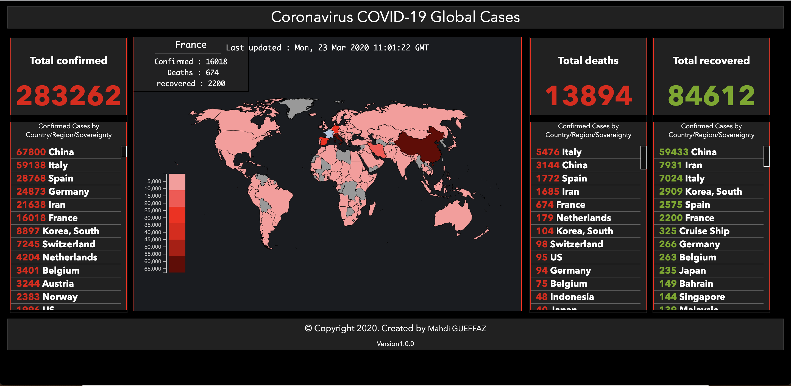
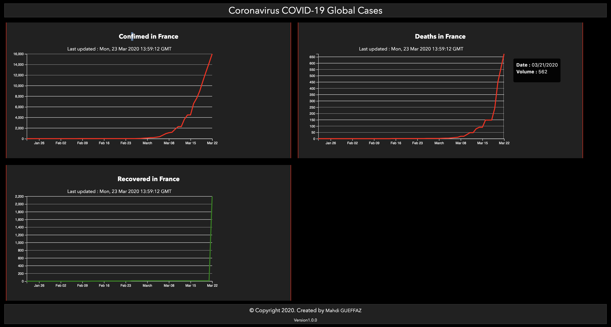

# COVID-19 stats


## About

An app to analysis data about the corona virus / COVID-19 on the world of the number of deaths, confirmed and recovered person. 

Charts of evolution of deaths, confirmed and recovered by country.

## Screenshot






## Features
* __Live data__: Shows the most recent data, and updates automatically.
* __Distribution map__ with two levels of details:
  * __Countries__: When the user mouse over country on the map. Fewer details show the number of deaths, confoirmed and recovered are shown.
  * __List__ : list of the coutnries regrouped by deaths, confirmed and recovered+.
* __Charts__:
   * __Current state chart__ for all countries (and cities).
   * __Timeline chart__ for all countries (and cities).
   * __Top affected countries__ chart with info about every country.
  * Option for using a __logarithmic__ scale.
* __Red color scale__: Reflects the number of confirmed cases. In addition to increasing circle size.
* __Statistics__: Including the number of confirmed, recovered, and deaths, in addition to percents.

## How to Use
#### Build from source code
```
1. Clone/Download the repo.
2. Install the requiremenet : `make install`
2. Execute & run! : `make run`
3. Visit your browser : http://localhost:5000
4. Enjoy ;)
```
#### Runing tests
```
make test
```

## TODO

* __Search__ for countries & cities.
* __Cities__ add détails of the cities
* __Chart__ add map by country and their détails by city
* __Share__ stats & charts as images.
* __Active__ Add the active person by country

 ## Data

 The data of coronavirus are retrieve from the api of the github project : https://github.com/ExpDev07/coronavirus-tracker-api

 ## The map
 The used map are the same used on d3dataviz. Visit the website : https://www.datavis.fr/index.php?page=map-improve


## Contribute
Please feel free to contribute pull requests or create issues for bugs and feature requests.

## License
The app is available for personal/non-commercial use. It's not allowed to publish, distribute, or use the app in a commercial way.

## Author
Mahdi Gueffaz (mahdi.gueffaz@gmail.com)